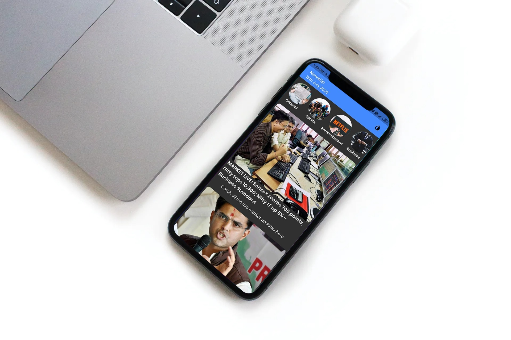
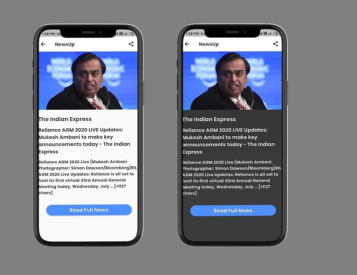
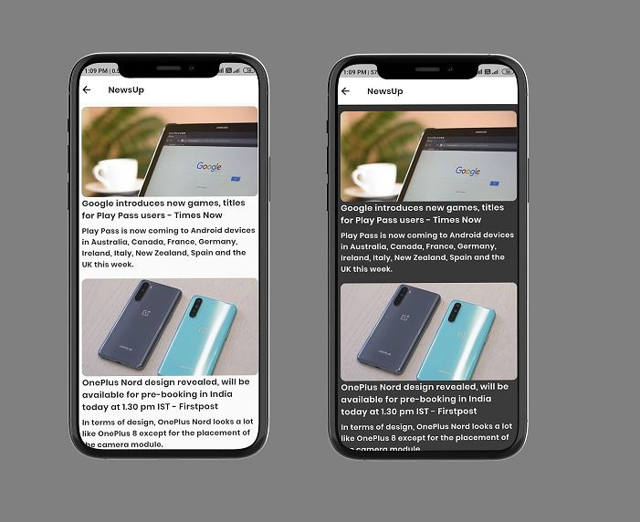

# NewsUp

Get the latest news form the top sources.
Switching to dynamic themes🎇 during runtime and persisting that theme is pretty simple to implement in Flutter App Development . Using this feature I had developed "NewsUp" , a simple and Convenient Mobile app to get the latest News from the Top sources. Fetched the data from the api provided by Newsapi.org 

# Screenshots

  <tr>
    <td></td>  
 </tr>
  <tr>
    <td></td>  
 </tr>
  <tr>
    <td></td>  
 </tr>
